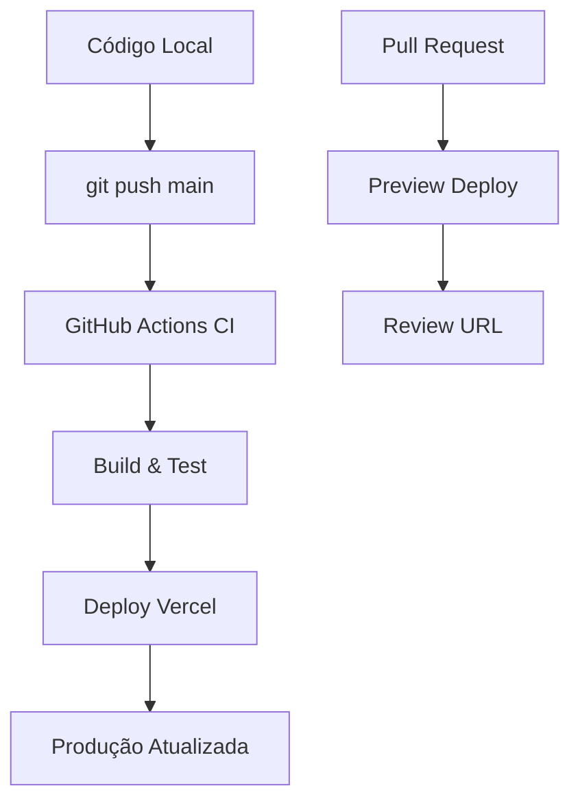

# ⚡ AUTO-DEPLOY SETUP - FrozenSaaSApp

## 🎯 **MÉTODO SIMPLES (Recomendado)**

### **1. Configurar no Vercel Dashboard:**

🔗 **Vá em:** https://vercel.com/dashboard → Projeto → **Settings** → **Git**

**Configure:**
```
✅ Connected Git Repository: github.com/Marseau/FrozeSaaSApp
✅ Production Branch: main
✅ Automatic Deployments: ON
✅ Root Directory: frontend
```

**Build Settings:**
```
Build Command: npm run build
Output Directory: dist
Install Command: npm install --legacy-peer-deps
```

### **2. Resultado:**
- 🚀 **Push no main** = Deploy automático em produção
- 🔍 **PR/Branch** = Deploy preview automático
- ⚡ **Zero configuração extra** necessária

---

## 🏗️ **MÉTODO AVANÇADO (GitHub Actions)**

Se quiser controle total, use o arquivo `.github/workflows/deploy.yml` que criei.

**Precisa configurar secrets no GitHub:**

### **GitHub Secrets (Settings → Secrets):**
```
VERCEL_TOKEN: (token do Vercel)
ORG_ID: (ID da organização Vercel)
PROJECT_ID: (ID do projeto Vercel)
```

**Para obter esses IDs:**
```bash
npx vercel --token=seu_token
# Ou no dashboard Vercel → Project Settings
```

---

## ✅ **VERIFICAÇÃO DE FUNCIONAMENTO:**

### **Teste 1: Push automático**
```bash
echo "// Test auto-deploy" >> frontend/src/App.tsx
git add . && git commit -m "test: Auto-deploy verification"
git push origin main
```

### **Teste 2: Verificar deploy**
- Vercel Dashboard → Deployments
- Deve aparecer novo deploy automaticamente
- Status deve ser "Ready"

---

## 🎯 **FLUXO IDEAL DE DESENVOLVIMENTO:**



---

## 🚨 **PROBLEMAS COMUNS:**

### **Deploy não executa:**
- Verificar se branch está correto (main)
- Verificar se path está correto (frontend/**)
- Verificar conexão GitHub ↔ Vercel

### **Build falha:**
- Verificar dependências (package.json)
- Verificar comando de build
- Verificar Node.js version

### **404 em produção:**
- Verificar Root Directory: frontend
- Verificar Output Directory: dist
- Verificar rewrites no vercel.json

---

🎯 **Recomendo começar com MÉTODO SIMPLES e depois migrar para avançado se necessário!**